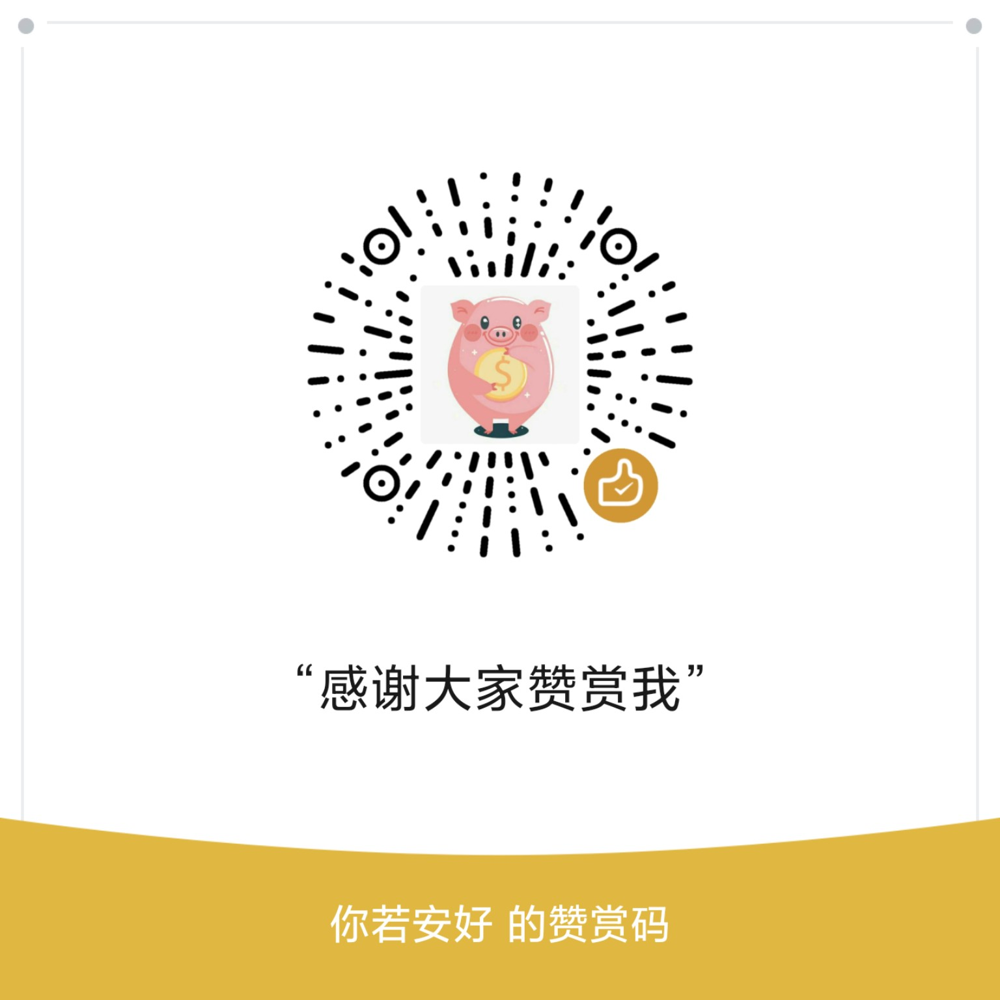

# 羊毛打卡管家 / Wool Check-in Manager

<p align="center">
  <a href="#zh">中文</a> · <a href="#en">English</a> · <a href="#sponsor">☕ 支持作者</a>
</p>

自用多端「羊毛 / 签到」打卡记录工具。数据优先保存在浏览器本地，可选同步到 Cloudflare KV，方便手机与电脑共用。

A personal multi-device check-in tracker for daily promo / sign-in tasks. Data is stored locally first, with optional sync to Cloudflare KV.

---

<a id="zh"></a>

## 中文说明

[English version ↓](#en)

### 功能概览

- **今日打卡**：按分组查看进度，打卡 / 补卡
- **任务管理**：名称、分组、天数、每日次数、连续打卡、现金或奖品、APP 跳转 / 网页链接
- **全部任务**：筛选进行中 / 已挂起 / 已完成、搜索、批量操作（置顶、挂起、改分类、归档、删除）
- **挂起**：暂时不打的任务可挂起（不出现在今日，历史保留，可随时恢复）
- **日历**：按月查看打卡分布
- **公告栏**：可编辑，多端同步
- **多端同步**：密码保护；本地与云端合并，减少「上传失败导致进度被冲掉」
- **备份**：导出 / 导入 JSON、CSV；同步日志；设备备注
- **历史快照**：仅保存在本机，最近 2 天，不上传云端
- **深色模式**：跟随系统或手动切换

### 在线使用

1. 浏览器打开你的 Pages 地址  
2. 可不设同步密码，数据只存在本机  
3. 多设备同步：点击左上角同步区域 → 设置与服务端一致的同步密码  
4. 之后打开页面会自动拉取、合并，有变更时写回云端  

重要操作前后建议在「备份管理」中导出一份 JSON。

### 部署（Cloudflare Pages + KV）

#### 需要的文件

推荐单页结构：

```text
/
├── index.html                 # 前端（可将 羊毛打卡管家.html 改名为 index.html）
└── functions/api/
    ├── get-data.js            # 读取云端数据
    └── save-data.js           # 合并并写入云端
```

#### 步骤

1. Cloudflare Dashboard → **Workers & Pages** → 创建 Pages 项目（连接 Git 或直接上传）  
2. 构建设置（纯静态）：Build command 留空；输出目录为站点根目录  
3. 创建 KV 命名空间，在 Pages → **Settings → Functions → KV bindings** 中绑定：  
   - **变量名必须为 `dk`**（与代码中 `env.dk` 一致）  
4. **Settings → Environment variables**（Production）可选配置：  

| 变量名 | 说明 |
|--------|------|
| `SYNC_PASSWORD` | 同步密码，需与前端填写的一致 |

不设置密码则接口不校验（仅适合个人测试，公网不建议）。

5. 重新部署后打开站点，点同步，确认不再出现接口 404 或密码错误。

#### 接口

| 方法 | 路径 | 作用 |
|------|------|------|
| GET | `/api/get-data` | 读取云端整包 JSON |
| POST | `/api/save-data` | 服务端合并后写回 |

请求头：`X-Sync-Password: 你的密码`（若配置了 `SYNC_PASSWORD`）。

#### 关于改代码时要不要动哪个文件

| 文件 | 职责 | 何时需要改 |
|------|------|------------|
| `index.html` | UI、本地存储、合并策略、是否上传快照等 | 功能与界面变更时 |
| `save-data.js` | 服务端合并任务 / 账本 / 设备等并写入 KV | 合并规则、写库字段变更时 |
| `get-data.js` | 校验密码后原样返回 `daka_main_data` | 一般**不用改**；除非换 key、鉴权或返回结构 |

主数据在 KV 中的 key 为：`daka_main_data`（单个 key 存整包，适合个人体量）。

### 日常使用

#### 今日打卡

- 底部进入 **今日打卡**
- 点 **打卡**；漏打可用 **补卡**（按规则补昨天等）
- 已挂起的任务不会出现在今日，也不计入今日进度

#### 新增 / 编辑任务

- 在 **全部任务** 中添加或编辑
- 可填：名称、分组、开始日期、备注、目标天数、每天次数、是否连续、收益、APP / 网页链接
- 表单可在弹窗内滚动

#### 挂起 / 恢复

- 仅在 **全部任务** 卡片上操作（今日页无挂起按钮）
- **挂起**：保留历史，不进今日
- **恢复**：回到今日列表（若仍为进行中）
- 批量管理中支持批量挂起 / 恢复
- 筛选中有 **已挂起**

恢复后打卡、补卡逻辑与挂起前相同；挂起期间不会自动补记中间日期。若任务要求连续打卡，中间隔了多天，恢复后可能按原规则提示断签。

#### 同步

- 各设备使用同一同步密码
- 打开页面自动同步；也可点左上角手动同步（**同步进行中请勿连点**）
- 双击同步区域可重设密码
- 下载时：本地与云端 **合并**（打卡记录取并集），不是简单覆盖
- 合并后如有需要会写回云端
- 若检测到可能丢进度，会弹出确认：  
  - **保留本地并上传**：继续用本机并推到云端  
  - **继续合并**：采用合并结果（可能含其他设备的删除）

#### 备份管理（右上角更多）

| 能力 | 说明 |
|------|------|
| 导出 JSON / CSV | 换机或大改前建议导出 JSON |
| 导入 | 可覆盖或与本地合并 |
| 历史快照 | **仅本机**最近 2 天，不上传云端；可恢复到某天 |
| 同步日志 | 最近约 50 条上传/下载记录 |
| 设备备注 | 给设备起名，云端共享 |

清空数据前务必先导出。快照不能替代跨设备备份；换机请靠云端任务同步或 JSON 导出。

#### 数据存在哪

| 位置 | 内容 |
|------|------|
| 浏览器 localStorage | 任务、打卡、账本、同步日志、**本机快照**、设备、主题、公告等 |
| Cloudflare KV（`dk` → `daka_main_data`） | 开启同步后的云端主数据（任务等；**不含**快照） |

清除站点数据会丢掉该设备本地副本（含本机快照）；云端任务仍在，设同一密码同步可再拉取。

### 免费额度说明

面向个人、约数台设备、约百条任务设计。静态流量极低；每次打开约 1 次 KV 读，有变更时再写。一般可长期使用 Cloudflare 免费档。请勿把同步密码发给无关人员。

### 常见问题

**同步失败？**  
检查网络、Functions 是否部署、`/api/get-data` 是否 404、KV 绑定名是否为 `dk`、密码是否与 `SYNC_PASSWORD` 一致。

**A 设备打了卡，B 看不到？**  
确认 A 上传成功；在 B 打开或点同步。可查看备份管理中的同步日志。

**提示数据回退？**  
优先看说明；多数会自动合并。弹窗时选「保留本地并上传」可避免丢掉本机进度。

**编辑任务滑不动？**  
请使用已修复弹层滚动的版本（表单区域 `.pop-body` 可滚）。

**换手机？**  
打开同一站点 → 同一同步密码 → 等待拉取；或从旧手机导出 JSON 再导入。

**能否多人各记各的？**  
当前是共享一份云端数据 + 同一密码，适合自己的多台设备，不适合多人独立账本。

### 许可与声明

本项目采用仓库内 `LICENSE` 所述的限制性许可。未经作者书面许可，不得公开再发布、商业使用，或将本项目及其衍生版本作为自己的项目发布。

与各 APP 官方活动无关，仅作个人打卡记录。

---

<a id="en"></a>

## English

[中文说明 ↑](#zh)

### Features

- **Today**: Grouped list, check-in / make-up check-in
- **Tasks**: Name, category, target days, times per day, streak mode, cash or prize, app scheme / web link
- **All tasks**: Filters (active / paused / finished), search, batch actions (pin, pause, category, archive, delete)
- **Pause**: Hide from Today without deleting history; resume anytime
- **Calendar**: Monthly check-in overview
- **Announcement**: Editable, synced across devices
- **Multi-device sync**: Password-protected; merge local and cloud to reduce rollback after failed uploads
- **Backup**: Export / import JSON & CSV; sync log; device labels
- **Snapshots**: **Local only**, last **2 days**, not uploaded to the cloud
- **Dark mode**: System or manual

### Quick start

1. Open your Pages URL in a browser  
2. You can skip the sync password; data stays on-device only  
3. For multi-device: tap the sync area (top-left) and set the same password as the server  
4. Later opens will pull, merge, and write back when needed  

Export a JSON backup from **Backup** before major changes.

### Deploy (Cloudflare Pages + KV)

#### Files

```text
/
├── index.html
└── functions/api/
    ├── get-data.js
    └── save-data.js
```

#### Steps

1. Create a Pages project (Git or direct upload)  
2. Static site: empty build command; output = site root  
3. Create a KV namespace; bind it under **Settings → Functions → KV bindings** with variable name **`dk`** (must match `env.dk`)  
4. Optional Production env var:  

| Name | Purpose |
|------|---------|
| `SYNC_PASSWORD` | Must match the password entered in the app |

5. Redeploy, open the site, sync once, and confirm no 404 / wrong password.

#### APIs

| Method | Path | Role |
|--------|------|------|
| GET | `/api/get-data` | Read full cloud JSON |
| POST | `/api/save-data` | Merge and write |

Header: `X-Sync-Password: <password>` when `SYNC_PASSWORD` is set.

#### Which file to edit

| File | Role | When to change |
|------|------|----------------|
| `index.html` | UI, local storage, merge policy, snapshots, etc. | Feature / UI changes |
| `save-data.js` | Server-side merge and KV write | Merge rules / stored fields |
| `get-data.js` | Auth + return `daka_main_data` as-is | Rarely; only if key, auth, or response shape changes |

KV key: `daka_main_data` (single document; fine for personal scale).

### Daily use

#### Today

- Check in or make up missed check-ins  
- Paused tasks are hidden and excluded from today’s progress  

#### Pause / resume

- Only on **All tasks** (no pause button on Today)  
- Pause keeps history; Resume brings the task back when still active  
- Batch pause / resume supported; filter **Paused** available  

After resume, check-in rules are unchanged. Gap days are not auto-filled. Continuous tasks may show a streak-break prompt if days were skipped.

#### Sync

- Same password on every device  
- Auto sync on open; manual sync via top-left (**don’t spam-click while syncing**)  
- Double-tap sync area to reset password  
- Download **merges** local and cloud (union of check-in history), then may upload  
- Risk dialog: **Keep local & upload** vs **Continue merge**

#### Backup

| Item | Notes |
|------|--------|
| Export JSON / CSV | Prefer JSON before big changes |
| Import | Overwrite or merge |
| Snapshots | **This device only**, 2 days; not in the cloud |
| Sync log | ~50 recent entries |
| Device notes | Shared via cloud |

Snapshots are not a cross-device backup. Use cloud task sync or JSON export when changing phones.

#### Where data lives

| Place | Content |
|-------|---------|
| `localStorage` | Tasks, history, ledgers, sync log, **local snapshots**, devices, theme, announcement |
| KV (`dk` → `daka_main_data`) | Cloud main payload when sync is enabled (**no** snapshots) |

### Free tier

Designed for a few devices and ~100 tasks. Usually stays within Cloudflare free limits. Do not share your sync password.

### FAQ

**Sync fails?** Network, Functions deploy, `/api/get-data` 404, KV binding name `dk`, password mismatch.

**Checked in on A, missing on B?** Confirm A uploaded; open or sync on B; check sync log.

**Rollback warning?** Prefer merge; use **Keep local & upload** to protect local progress.

**New phone?** Same URL + password, or import JSON from the old device.

**Multi-user separate books?** No — one shared cloud dataset and one password, for your own devices only.

### License & disclaimer

Copyright © 2026 羊毛打卡管家项目作者。

This repository is **not** released under an open-source license. The source code and original project materials are provided for viewing and learning only. Unless you have received separate written permission from the author, you may not copy, republish, redistribute, sublicense, commercially use, sell, or present this project or a modified version of it as your own.

You may fork or download the repository for personal reference, but this does not grant permission to publish or distribute the project or derivative works. See [`LICENSE`](./LICENSE) for the full terms.

Not affiliated with any app’s official campaigns; for personal check-in logging only.

---

<a id="sponsor"></a>

## 赞赏支持 / Support

如果这个项目对你有帮助，欢迎请作者喝杯咖啡 ☕  
赞赏完全自愿，不影响项目的正常使用。感谢每一份支持！

<div align="center">
  
  <br>
  <sub>感谢你的支持 ❤️</sub>
</div>

If this project is helpful to you, you're welcome to buy the author a coffee ☕  
Sponsorship is entirely optional. Thank you for your support!
